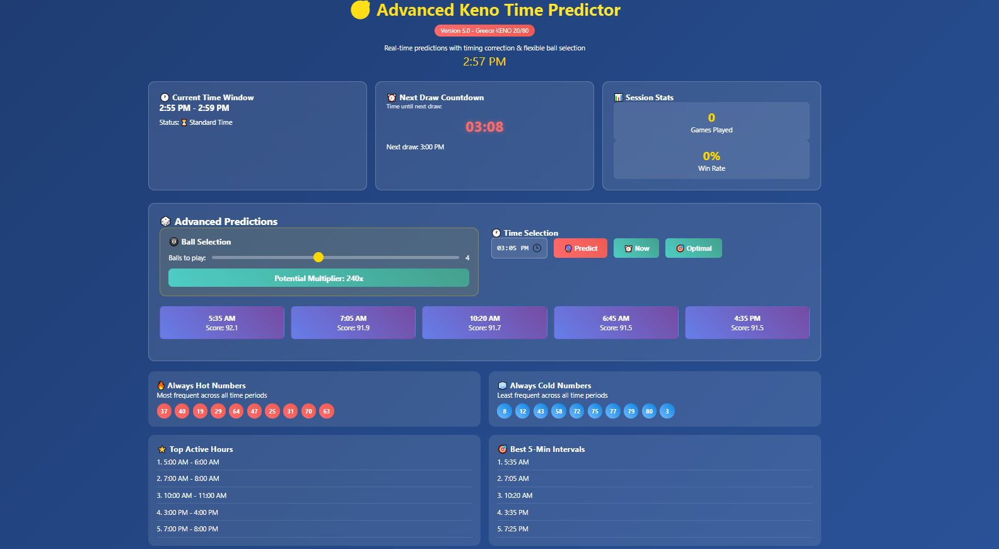
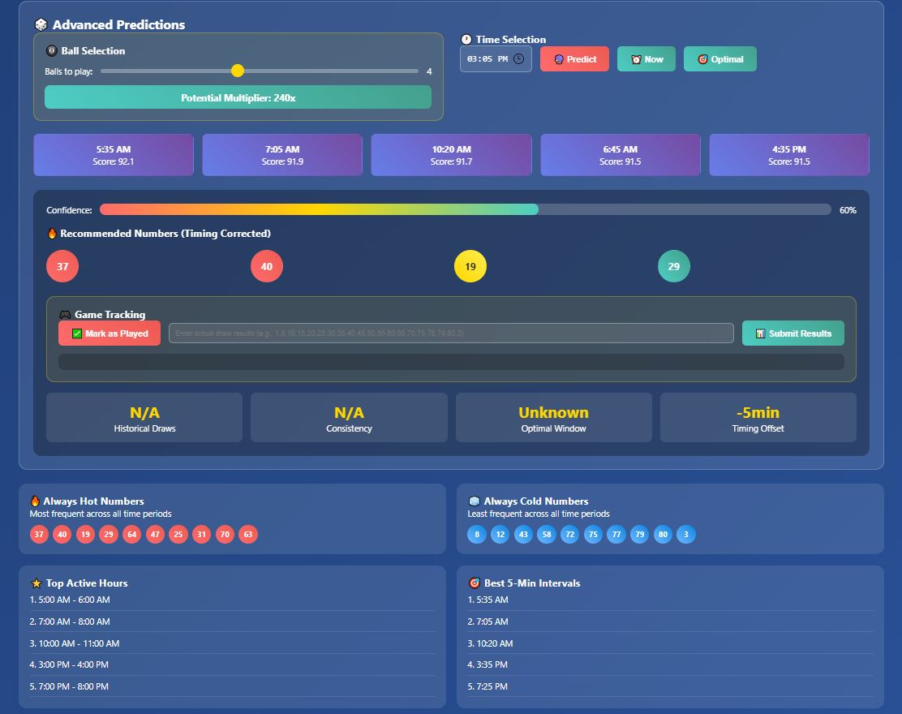

# Advanced Keno Time Predictor V5

**Portfolio Project** · Greece KENO 20/80 (BCGame) · Data → Analysis → Interactive Dashboard

> ⚠️ **Important**: This project is for educational and entertainment purposes only. Lottery/Keno outcomes are random; no analysis can guarantee wins. Play responsibly and comply with all local laws.

---

## What this project does

- **Data engineering**: load and clean scraped historical draw data from BCGame’s Greece KENO 20/80 page.
- **Time-based analytics**: identify optimal play times with the highest pattern consistency.
- **Config exports**: generate JSON, JS, and Python configs for the dashboard.
- **Frontend dashboard**: an HTML interface for exploring predictions and patterns.

---

## Actual directory structure (local example)

```
C:\Keno
├── raw_keno_data.txt               # Raw scraped KENO results from BCGame (3000+ records)
├── format_raw_keno_data.py         # Cleans raw scrape into keno_final_cleaned.csv
├── keno_analyzer_v5.py             # Time-based analysis + exports configs
├── keno_time_predictor_version5.html # V5 interactive dashboard (uses config)
├── keno_final_cleaned.csv          # Cleaned dataset ready for analysis
├── venv/                           # Python virtual environment (not committed)
├── Version Documents/              # Supporting docs (optional)
└── .idea/                          # IDE project settings (not committed)
```

---

## How it works

1. **Scrape data** from [BCGame Greece KENO 20/80](https://bcgame.lu/lottery/detail/49024) and save as `raw_keno_data.txt`.
2. **Format raw data**:

```bash
python format_raw_keno_data.py
```

Produces `keno_final_cleaned.csv` with columns:

```
Lottery Issue,Date,Time,Ball 1,...,Ball 20
```

3. **Analyze** cleaned data:

```bash
python keno_analyzer_v5.py
```

Generates:

- `keno_time_analysis_v4.json`
- `keno_config_v4.js`
- `keno_patterns_v4.py`

4. **Run the V5 dashboard**: Open `keno_time_predictor_version5.html` in your browser or run:

```bash
python -m http.server 8000
# Visit http://localhost:8000/keno_time_predictor_version5.html
```

---

## Prerequisites

- Python 3.9+

```bash
pip install pandas numpy
```

---

## Troubleshooting

- If analysis fails, check that `keno_final_cleaned.csv` exists and is in the correct format.
- If dashboard does not show predictions, verify that `keno_config_v4.js` is generated and accessible.
- For CORS errors, run via `python -m http.server` instead of double-clicking the HTML.

---

## Suggested repo extras

- `requirements.txt`:

```
pandas>=2.0
numpy>=1.24
```

- `.gitignore`:

```
.venv/
__pycache__/
.idea/
Version Documents/
*.pyc
*.json
*.js
*.csv
raw_*.txt
data/
```

- **Screenshots** of the dashboard.

<p float="left">
  <a href="screenshots/dashboard_main.JPG">
    
  </a>
  <a href="screenshots/dashboard_predict_number.JPG">
    
  </a>
</p>

---

## Credits

Developed by **Amjad M. Kamara**.

